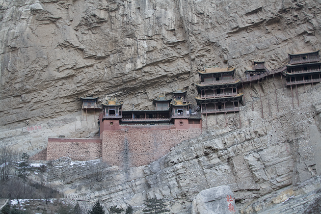
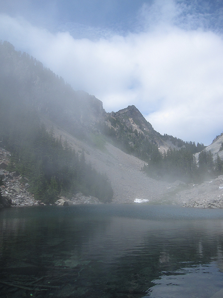

# 楊兆尹 <span style="color:red">103020010</span>

# Project 2 / Panorama Stitching

## Overview
The project utilizes SIFT keypoints of images to combine them into a single panoramic image.


## Implementation
1. Matching SIFT Descriptors
* Use forloop to interate the descriptor1. Calculate whether or not there is a match point in descriptor2 by calculate Euclidean Norm
```
match = []
N1 = descriptor1.shape[0]
N2 = descriptor2.shape[0]
for i in range(N1):
	m = descriptor2 - np.tile(descriptor1[i, :],(N2,1))
	e_dis = LA.norm(m, axis=1)
	sort_idx = np.argsort(e_dis)    #smallest to largest
	min_idx = sort_idx[0]
	min2_idx = sort_idx[1]
	if(e_dis[min_idx] < THRESH * e_dis[min2_idx]):
		match.append([i, min_idx])
match = np.array(match)
```
2. Fitting the Transformation Matrix
* Use lstsq() to calculate the solution of H*P1=P2 by first transpose both sides of equation.
```
H_trans = np.linalg.lstsq(P1.T, P2.T,rcond=None)[0]
H = H_trans.T
H[2,:] = [0, 0, 1]
```
3. RANSAC: ComputeError()
* First extract the match points in pt1 and pt2. Do matrix multiplication of extracted points of pt1 and H. Then calculate Euclidean Norm between the result and pt2 points.
```
N = match.shape[0]
m1 = pt1[match[:,0], :]
m2 = pt2[match[:,1], :]

M1 = np.concatenate([m1.T, np.ones([1,N])], axis=0)
y_hat = np.matmul(M1.T, H.T)
m2_hat = y_hat[:,0:2]
differences = m2 - m2_hat
dists = np.sqrt(np.sum(np.square(differences), axis=1))
```

4. Stitching Multiple Images: makeTransformToReferenceFrame()
* If currentFrameIndex is less than refFrameIndex, Continuously multiply each transformation matrix of adjacent frames as T.
* If currentFrameIndex is larger than refFrameIndex, Continuously multiply each inverse transformation matrix of previous adjacent frames as T.
* If currentFrameIndex is equal to refFrameIndex, T is equal to identity matrix.
```
if(currentFrameIndex<refFrameIndex):
	T = np.array(i_To_iPlusOne_Transform[currentFrameIndex])
	n_mats = refFrameIndex - currentFrameIndex
	for i in range(n_mats-1):
		next_mat = np.array(i_To_iPlusOne_Transform[currentFrameIndex+i+1])
		T = np.matmul(next_mat, T)
elif(currentFrameIndex>refFrameIndex):
	T = np.linalg.pinv(np.array(i_To_iPlusOne_Transform[currentFrameIndex-1]))
	n_mats = currentFrameIndex - refFrameIndex
	for i in range(n_mats-1):
		next_mat = np.array(i_To_iPlusOne_Transform[currentFrameIndex-i-2])
		T = np.matmul(np.linalg.pinv(next_mat), T)
else:
	T = np.identity(3)
```

## Installation
* Anaconda
* cyvlfeat package
* matplotlib

### Results

<table border=1>
<tr>
<td>



</td>
</tr>

<tr>
<td>



</td>
</tr>

<tr>
<td>


</td>
</tr>

<tr>
<td>

</td>
</tr>

<tr>
<td>

</td>
</tr>

</table>
